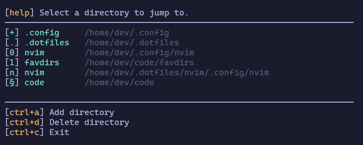

# Favdirs - Favourite Directories

Favdirs is terminal navigator that allows you to save directories as keybinds to jump to them easily without writing file paths or search terms.

## Technology

- [Go](https://go.dev/#)
- [Bubbletea](https://github.com/charmbracelet/bubbletea)
- [Lipgloss](https://github.com/charmbracelet/lipgloss)
- [Task](https://taskfile.dev/)

## Install

```bash
# using task
mv taskfile.dist.yaml taskfile.yaml
task build

# using commands directly
go build -o ./build/app ./cmd/app/main.go
go run ./cmd/install/main.go
cd && source .bashrc
```

## Usage

```bash
# add current directory to favourites bound to given key
fd <key>

# open list of favourite directories 
fd
```

## Concept

I don't like navigating with cd in the terminal. Within projects I'm usually jumping around using neovim, fzf, marks, or code symbols, but I wanted something to easily jump between projects or other directories that I often might use. I wanted to learn how to write terminal UIs and something about terminal integrations, so I wrote this little toy program to do that.

The problem is quite simple: just feed a file path to cd. But apparently scripts and CLIs run in their own sub terminals and passing data between them didn't quite work as I expected so I ended up using files as the medium.

The app works by saving locations into a file, pairing keybinds with directory paths. When a user selects a location to jump to, the app writes the selected path to another file, and a shell function reads it from the file and invokes cd. Probably a round-about way to do it, but it worked. ¯\\\_(ツ)\_/¯

I also needed an easy way to automate building and installing the app, so I wrote a script for that, also in Go, and automated the process with Task. The installer copies the built executable to a home directory and creates the required location and select files. It also updates the .bashrc file with an integration function by using Go templates. The whole operation can be done with one 'task build' command. I don't have an uninstaller yet...

## Take-aways

Bubbletea is a cool library for building terminal UIs. For someone coming from web apps, it's very similar to reactive frontend SPAs in that you basically have a state-view-update loop with events, like you would have with Redux or other flux-like (or Elm-like) state management systems. I imagine it can be nice for building internal tools, deployment scripts, and 'native' apps in situations where web apps don't make sense. Lipgloss is a nice library for styling the UI. It feels very much like CSS in the way it defines style-able properties and works nicely with for styling even plain strings.

I've seen a lot of scripts written in bash but they usually come with pitfalls between different operating systems, and more complicated logic can be a bit hard to express, or maybe I'm just unfamiliar with the syntax and it's a skill issue... This time I wanted to try Go for scripting purposes to have a more unified(?) experience between systems. Some operations are definitely quite verbose to write compared to simpler bash tools, but I found it quite nice to have the power to basically do anything as long as I knew how to use the standard library for file manipulation. I was especially happy I was able to automate add and updating the shell integration logic so that I basically had to only do it once while I iterated on the app. Another nice thing about Go is that it compiles super fast and has basically no start-up time, which is ideal for frequently ran CLI tools. 
